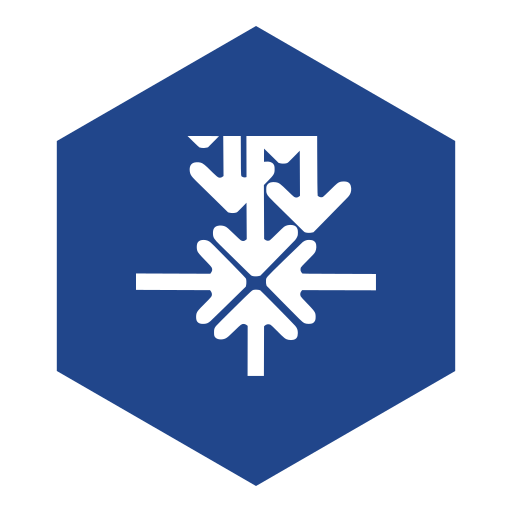
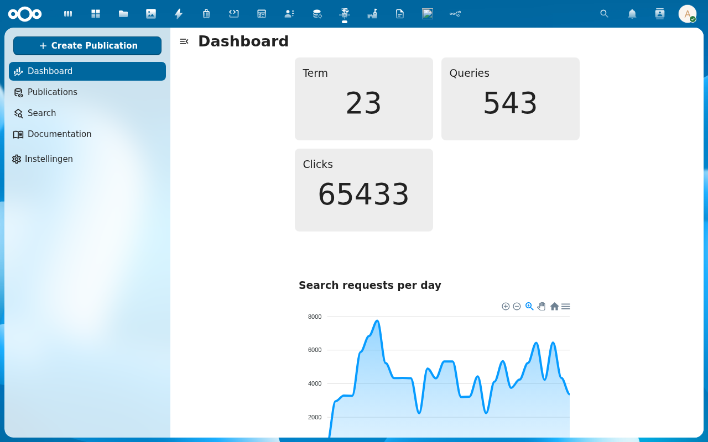
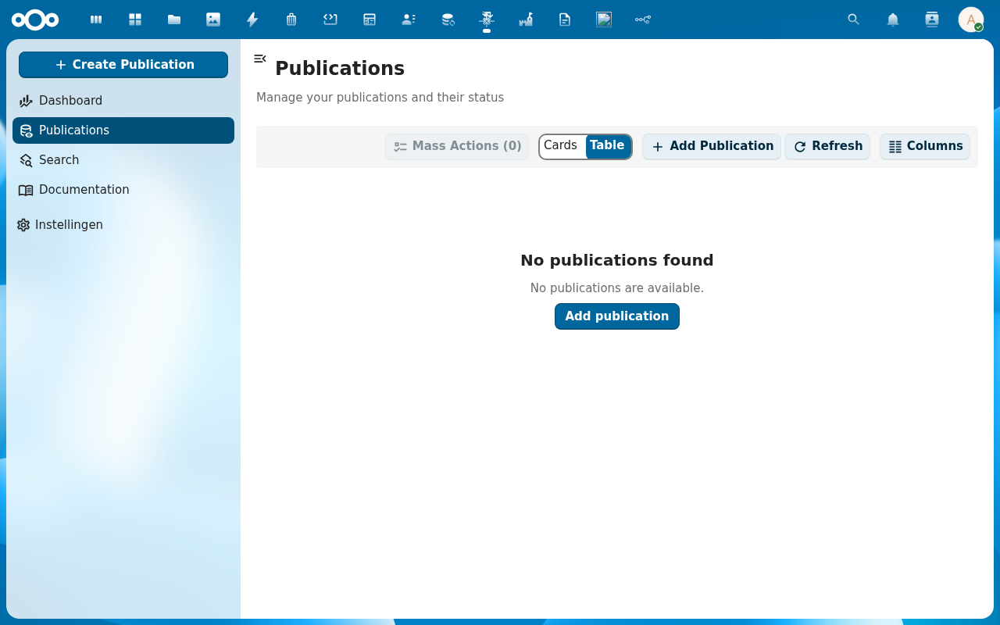
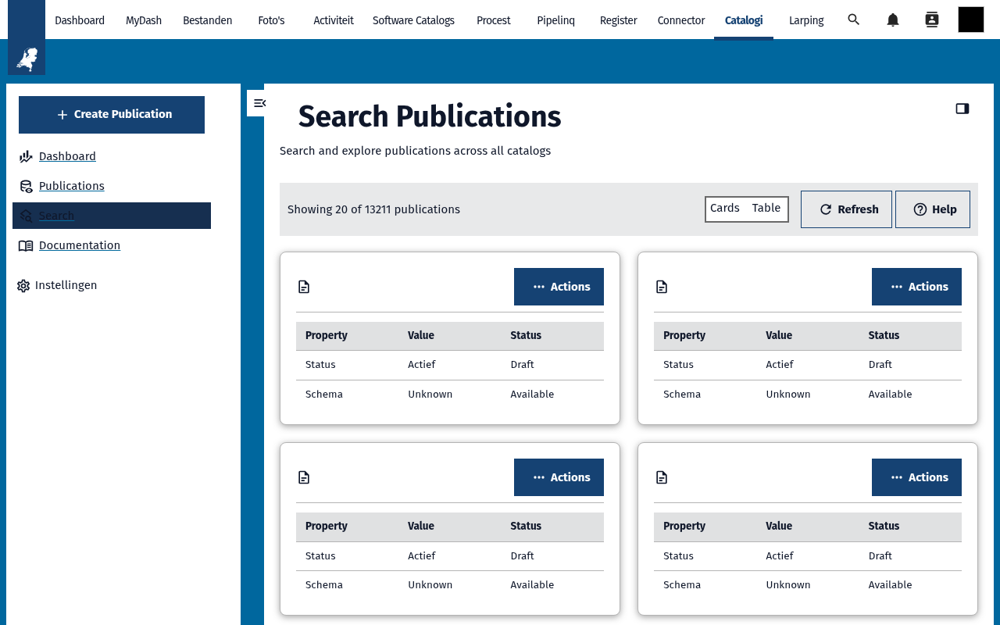
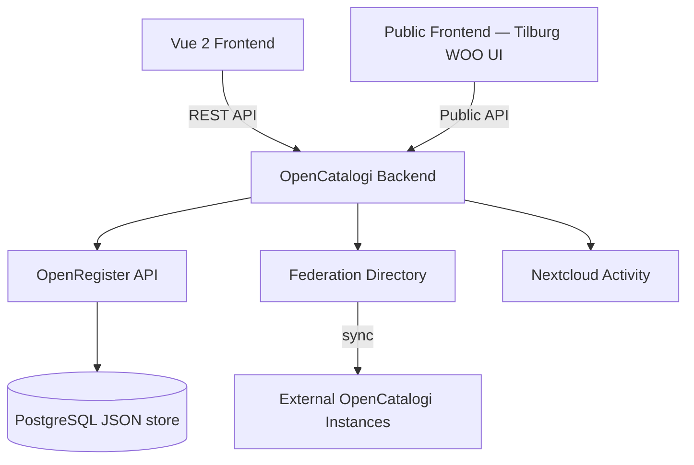

<p align="center">
  
</p>

<h1 align="center">OpenCatalogi</h1>

<p align="center">
  <strong>Publication management and catalog federation for Nextcloud — publish, discover, and share open data across organizations</strong>
</p>

<p align="center">
  <a href="https://github.com/ConductionNL/opencatalogi/releases"></a>
  <a href="https://github.com/ConductionNL/opencatalogi/blob/main/LICENSE"></a>
  <a href="https://github.com/ConductionNL/opencatalogi/actions"></a>
  <a href="https://documentatie.opencatalogi.nl"></a>
</p>

---

OpenCatalogi turns Nextcloud into a publication platform for open data and government transparency. Create catalogs, manage publications with metadata and attachments, and federate them across organizations so that citizens, businesses, and other government entities can discover and access public information. The app supports the Dutch WOO (Open Government Act) and follows Common Ground principles for interoperability.

It connects to a federated directory of other OpenCatalogi instances, enabling cross-organization search and discovery without centralized infrastructure. A public-facing frontend can be deployed separately for citizen access, while administrators manage everything from within Nextcloud.

> **Requires:** [OpenRegister](https://github.com/ConductionNL/openregister) — all data is stored as OpenRegister objects (no own database tables).

## Screenshots

<table>
  <tr>
    <td></td>
    <td></td>
    <td></td>
  </tr>
  <tr>
    <td align="center"><em>Dashboard</em></td>
    <td align="center"><em>Publications</em></td>
    <td align="center"><em>Catalog</em></td>
  </tr>
</table>

## Features

### Publication Management
- **Create & Edit Publications** — Rich metadata editor for publications including title, summary, category, portal URL, and custom fields
- **Attachments** — Upload documents, images, and other files to publications with automatic metadata extraction
- **Publication Status** — Track publications through draft, published, and archived states
- **Bulk Operations** — Manage multiple publications at once with batch actions
- **Download & Export** — Generate downloadable packages of publications and their attachments

### Catalog Federation
- **Multiple Catalogs** — Create and manage separate catalogs for different domains or departments (e.g., WOO documents, software, datasets)
- **Federated Directory** — Register your catalogs in a shared directory so other organizations can discover and subscribe to them
- **Listings** — Subscribe to external catalogs and synchronize their publications into your local search index
- **Cross-Organization Search** — Query publications across all federated catalogs from a single search interface
- **Directory Sync** — Background cron job keeps federated listings up to date automatically

### Search & Discovery
- **Faceted Search** — Filter publications by category, organization, catalog, date range, and custom metadata fields
- **Full-Text Search** — Search across publication content and attached documents
- **Public Search API** — RESTful endpoints for external frontends and third-party integrations

### Content Management
- **Pages** — Create static content pages (about, contact, FAQ) served through the public API
- **Menus** — Define navigation menus for the public-facing frontend
- **Glossary** — Maintain a glossary of terms with definitions, shown alongside publications
- **Themes** — Configure visual themes for the public frontend with colors, logos, and styling

### WOO Compliance
- **Publication Categories** — Predefined categories aligned with WOO information categories (decisions, reports, advice, etc.)
- **Metadata Standards** — Structured metadata following Dutch government open data standards
- **Sitemap Generation** — Automatic sitemaps per catalog and category for search engine indexing
- **Robots.txt** — Configurable robots.txt for controlling crawler access

### Administration
- **Organization Management** — Configure the publishing organization with contact details and branding
- **Settings Panel** — Centralized admin settings for storage, publishing rules, and federation behavior
- **Manual Import** — Bulk import publications from external sources via the admin interface
- **Version Info** — View app version and configuration status from the settings page

## Architecture



### Data Model

| Object | Description | Standard |
|--------|-------------|----------|
| Publication | Core metadata wrapper for published information — title, summary, category, status | DCAT-AP |
| Attachment | File or document linked to a publication with its own metadata | DCAT Distribution |
| Catalogue | A named collection of publications with its own slug, organization, and settings | DCAT Catalog |
| Organisation | The publishing organization with contact info, logo, and branding | Schema.org Organization |
| Listing | A subscription to an external catalog from the federated directory | — |

**Data standards:** DCAT-AP (EU metadata), Schema.org, WOO information categories.

### Directory Structure

```
opencatalogi/
├── appinfo/           # Nextcloud app manifest, routes, navigation
├── lib/               # PHP backend
│   ├── Controller/    # REST API controllers (publications, catalogi, search, federation…)
│   ├── Service/       # Business logic (catalog, directory, publication, search, download)
│   ├── Cron/          # Background jobs (DirectorySync, Broadcast)
│   ├── Flow/          # Nextcloud Flow integration
│   ├── Listener/      # Event listeners
│   └── Settings/      # Admin settings panel
├── src/               # Vue 2 frontend — components, Pinia stores, views
│   ├── catalogi/      # Catalog management views
│   ├── publications/  # Publication editor and list views
│   ├── search/        # Search interface
│   ├── directory/     # Federation directory management
│   ├── themes/        # Theme configuration
│   ├── store/         # Pinia stores per entity
│   └── views/         # Route-level views
├── docs/              # Documentation (users, admins, developers, schemas)
├── img/               # App icons and screenshots
└── docusaurus/        # Product documentation site (documentatie.opencatalogi.nl)
```

## Requirements

| Dependency | Version |
|-----------|---------|
| Nextcloud | 28 -- 33 |
| PHP | 8.1+ |
| PostgreSQL / MySQL 8+ / SQLite | — |
| [OpenRegister](https://github.com/ConductionNL/openregister) | latest |
| System Cron | required for federation sync |

## Installation

### From the Nextcloud App Store

1. Go to **Apps** in your Nextcloud instance
2. Search for **OpenCatalogi**
3. Click **Download and enable**

> OpenRegister must be installed first. The app will attempt to install it automatically, or you can [install OpenRegister manually](https://apps.nextcloud.com/apps/openregister).

### From Source

```bash
cd /var/www/html/custom_apps
git clone https://github.com/ConductionNL/opencatalogi.git
cd opencatalogi
composer install --no-dev
npm install
npm run build
php occ app:enable opencatalogi
```

## Development

### Start the environment

```bash
docker compose -f openregister/docker-compose.yml up -d
```

To include the public frontend (Tilburg WOO UI):

```bash
docker compose -f openregister/docker-compose.yml --profile ui up -d
```

### Frontend development

```bash
cd opencatalogi
npm install
npm run dev        # One-time build (development mode)
npm run watch      # Watch mode with auto-rebuild
npm run build      # Production build
```

### Code quality

```bash
# PHP
composer phpcs          # Check coding standards
composer cs:fix         # Auto-fix PHPCS issues
composer phpmd          # Mess detection
composer psalm          # Static analysis
composer phpmetrics     # HTML metrics report

# Frontend
npm run lint            # ESLint
npm run stylelint       # CSS linting

# Full check (all tools)
composer check:strict   # Runs lint, phpcs, phpmd, psalm, phpstan, tests
```

## Tech Stack

| Layer | Technology |
|-------|-----------|
| Frontend | Vue 2.7, Pinia, @nextcloud/vue |
| Build | Webpack 5, @nextcloud/webpack-vue-config |
| Backend | PHP 8.1+, Nextcloud App Framework |
| Data | OpenRegister (PostgreSQL JSON objects) |
| Search | OpenRegister (SQL full-text + optional Solr/ES via OpenRegister) |
| PDF | mPDF for document generation |
| Templates | Twig for content rendering |
| Quality | PHPCS, PHPMD, Psalm, PHPStan, phpmetrics, ESLint, Stylelint |

## Documentation

Full documentation is available at **[documentatie.opencatalogi.nl](https://documentatie.opencatalogi.nl)**

| Section | Description |
|---------|-------------|
| [User Guide](docs/Users/index.md) | Publishing, searching, and managing publications |
| [Administrator Guide](docs/Administrator/README.md) | Catalog setup, directory configuration, themes, and metadata |
| [Developer Guide](docs/Developers/index.md) | Local development setup, architecture, and API reference |
| [Installation](docs/Installation/README.md) | On-premise, SaaS, and upgrade instructions |
| [Schemas](docs/schema/) | JSON Schema definitions for publications, catalogs, and attachments |

## Standards & Compliance

- **Metadata standard:** DCAT-AP (EU) for publication metadata interoperability
- **WOO compliance:** Publication categories aligned with Dutch Open Government Act requirements
- **Common Ground:** Follows Common Ground principles for federated, reusable government IT
- **Accessibility:** WCAG AA (Dutch government requirement)
- **Authorization:** RBAC via OpenRegister with organization-based multitenancy
- **Federation:** Decentralized directory protocol for cross-organization catalog sharing
- **Localization:** Dutch and English

## Related Apps

- **[OpenRegister](https://github.com/ConductionNL/openregister)** -- Object storage layer (required dependency)
- **[OpenConnector](https://github.com/ConductionNL/openconnector)** -- API gateway for importing data from external sources
- **[NL Design](https://github.com/ConductionNL/nldesign)** -- Design token theming for Dutch government styling
- **[DocuDesk](https://github.com/ConductionNL/docudesk)** -- Document generation from publication data
- **[Softwarecatalog](https://github.com/ConductionNL/softwarecatalog)** -- GEMMA software catalog built on OpenCatalogi

## License

This project is licensed under the [EUPL-1.2](LICENSE).

### Dependency license policy

All dependencies (PHP and JavaScript) are automatically checked against an approved license allowlist during CI. The following SPDX license families are approved for use in dependencies:

- **Permissive:** MIT, ISC, BSD-2-Clause, BSD-3-Clause, 0BSD, Apache-2.0, Unlicense, CC0-1.0, CC-BY-3.0, CC-BY-4.0, Zlib, BlueOak-1.0.0, Artistic-2.0, BSL-1.0
- **Copyleft (EUPL-compatible):** LGPL-2.0/2.1/3.0, GPL-2.0/3.0, AGPL-3.0, EUPL-1.1/1.2, MPL-2.0
- **Font licenses:** OFL-1.0, OFL-1.1

Dependencies with licenses not on this list will fail CI unless explicitly approved in `.license-overrides.json` with a documented justification.
## Authors

Built by [Conduction](https://conduction.nl) and [Acato](https://acato.nl) -- open-source software for Dutch government and public sector organizations.
