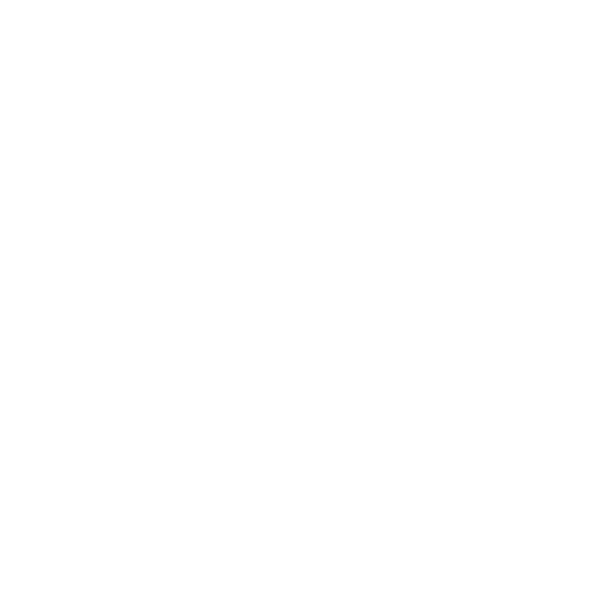
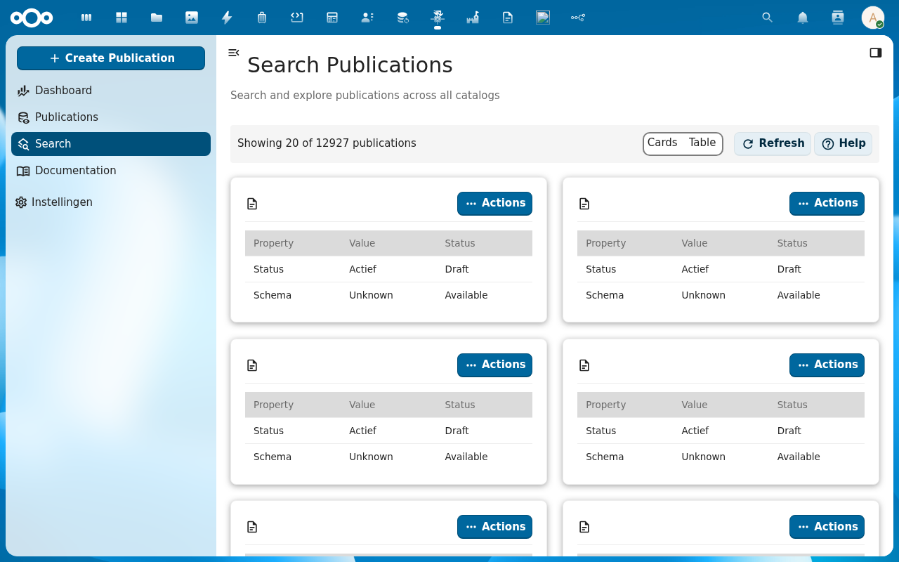
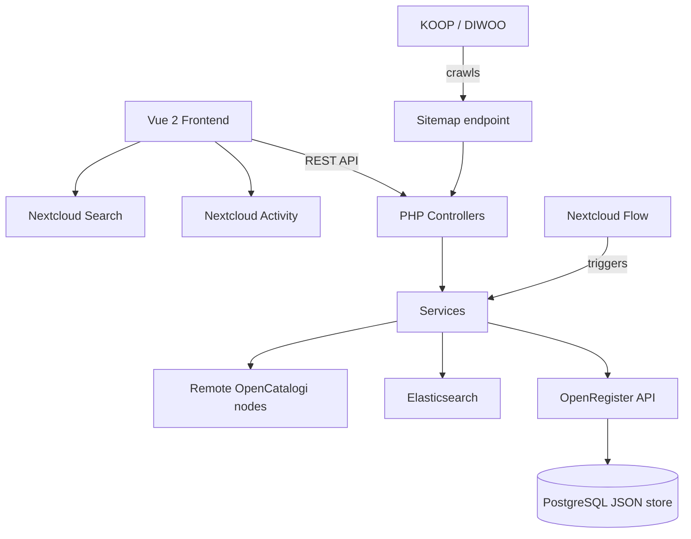

<p align="center">
  
</p>

<h1 align="center">OpenCatalogi</h1>

<p align="center">
  <strong>Open data catalog management for Nextcloud — WOO compliance, federated discovery, and citizen-facing publication search</strong>
</p>

<p align="center">
  <a href="https://github.com/ConductionNL/opencatalogi/releases"></a>
  <a href="https://github.com/ConductionNL/opencatalogi/blob/main/LICENSE"></a>
  <a href="https://github.com/ConductionNL/opencatalogi/actions"></a>
  <a href="https://documentatie.opencatalogi.nl"></a>
</p>

---

OpenCatalogi turns Nextcloud into a full-featured open data catalog platform. Organizations publish documents, software components, and datasets in federated catalogs that citizens and other systems can discover and search. It was built for Dutch government WOO (Wet Open Overheid) compliance but works for any organization that needs structured, searchable public content.

> **Requires:** [OpenRegister](https://github.com/ConductionNL/openregister) — all data is stored as OpenRegister objects (no own database tables).

## Screenshots

<table>
  <tr>
    <td></td>
    <td></td>
    <td></td>
  </tr>
  <tr>
    <td align="center"><em>Dashboard</em></td>
    <td align="center"><em>Publications</em></td>
    <td align="center"><em>Catalogs</em></td>
  </tr>
</table>

## Features

### Catalog Management
- **Multiple Catalogs** — Run independent catalogs with separate scopes, registers, schemas, and access controls
- **Catalog Theming** — Customize logo, colors, and branding per catalog
- **Publication Types** — Define taxonomies of document categories per catalog
- **Glossary** — Manage domain-specific terminology and definitions
- **Static Pages** — Create rich content pages within each catalog
- **Navigation Menus** — Build custom navigation structures per catalog

### Publications
- **Full CRUD** — Create, edit, publish, and archive documents with rich metadata
- **File Attachments** — Upload, organize, and version-track attached files with drag-and-drop
- **Auto-Publishing** — Automatically generate public share links for publication files
- **Rich Text Editing** — Toast UI Editor with markdown/WYSIWYG support
- **Metadata Fields** — Custom key-value metadata (text, date, select, multi-select)
- **Status Tracking** — Manage publication status through configurable lifecycle
- **Download & Export** — Export publications as PDF or ZIP archives with full metadata

### Search & Discovery
- **Keyword Search** — Full-text search across titles, descriptions, and metadata
- **Faceted Search** — Filter sidebar with aggregated count buckets per facet
- **Public Endpoints** — Unauthenticated citizen-facing search (no login required)
- **Multi-Catalog Search** — Unified search across all active catalogs
- **Elasticsearch Support** — Optional Elasticsearch backend for large-scale deployments

### Federation
- **WOO Federation** — Automatic DIWOO sitemap generation for KOOP and national discovery indexes
- **Remote Catalogs** — Aggregate publications from remote OpenCatalogi instances into local search
- **Manual Sync** — Trigger federation sync on demand from the admin interface
- **Automatic Sync** — Background cron job keeps federated content up to date
- **Broadcast** — Push local publications to other OpenCatalogi nodes

### Work Management
- **Dashboard** — Statistics and analytics on catalogs, publications, organizations, and activity
- **Dashboard Widgets** — Nextcloud Dashboard integration for quick overviews
- **Activity Feed** — Real-time updates on publication changes and assignments
- **Audit Trail** — Full change history on all objects

### Integrations
- **Nextcloud Flow** — Automation rules: auto-publish when conditions are met
- **Nextcloud Activity** — Native activity stream integration
- **Unified Search** — Deep links for publications in Nextcloud's global search
- **DIWOO Sitemap** — Automatic sitemap for Dutch government discoverability requirements

## Architecture



### Data Model

| Object | Description | Standard |
|--------|-------------|---------|
| Publication | Document or dataset with metadata and attachments | WOO Publicatie |
| Attachment | File linked to a publication | — |
| Catalog | Container for publications with independent configuration | — |
| Organization | Organizational unit with RBAC scope | VNG Organisatie |
| Publication Type | Taxonomy category for publications | — |
| Listing | Master data (categories, glossary entries) | — |
| Theme | Catalog branding configuration | — |
| Page | Static content page | — |
| Menu | Navigation structure | — |

**Data standard:** Common Ground + WOO (Wet Open Overheid) with DIWOO interoperability.

### Directory Structure

```
opencatalogi/
├── appinfo/          # Nextcloud app manifest, routes, navigation
├── lib/              # PHP backend — controllers, services, cron, flow, listeners
│   ├── Controller/   # Publications, Search, Catalogi, Directory, Federation, …
│   └── Service/      # Publication, Search, Catalogi, File, Elasticsearch, Download, …
├── src/              # Vue 2 frontend — components, Pinia stores, views
│   ├── views/        # Route-level views (publications, catalogi, search, dashboard, …)
│   ├── dialogs/      # Modal dialogs per entity
│   └── entities/     # Data model classes
├── website/          # Docusaurus documentation site
│   └── docs/         # Markdown documentation
├── img/              # App icons and screenshots
└── l10n/             # Translations (en, nl)
```

## Requirements

| Dependency | Version |
|-----------|---------|
| Nextcloud | 28 – 32 |
| PHP | 8.0+ |
| Database | PostgreSQL 10+, MySQL 8.0+, SQLite |
| [OpenRegister](https://github.com/ConductionNL/openregister) | latest |
| Elasticsearch | optional — for large-scale full-text search |

## Installation

### From the Nextcloud App Store

1. Go to **Apps** in your Nextcloud instance
2. Search for **OpenCatalogi**
3. Click **Download and enable**

> OpenRegister must be installed first. [Install OpenRegister →](https://apps.nextcloud.com/apps/openregister)

### From Source

```bash
cd /var/www/html/custom_apps
git clone https://github.com/ConductionNL/opencatalogi.git
cd opencatalogi
npm install
npm run build
composer install
php occ app:enable opencatalogi
```

## Development

### Start the environment

```bash
docker compose -f openregister/docker-compose.yml up -d
```

### Frontend development

```bash
cd opencatalogi
npm install
npm run dev        # Watch mode
npm run build      # Production build
```

### Code quality

```bash
# PHP
composer phpcs          # Check coding standards
composer cs:fix         # Auto-fix issues
composer phpmd          # Mess detection
composer phpmetrics     # HTML metrics report

# Frontend
npm run lint            # ESLint
npm run stylelint       # CSS linting
```

## Tech Stack

| Layer | Technology |
|-------|-----------|
| Frontend | Vue 2.7, Pinia, @nextcloud/vue, Bootstrap Vue |
| Editor | Toast UI Editor (rich text), CodeMirror 6 (code) |
| Charts | ApexCharts |
| Build | Webpack 5, @nextcloud/webpack-vue-config |
| Backend | PHP 8.0+, Nextcloud App Framework |
| Data | OpenRegister (PostgreSQL JSON objects) |
| Search | SQL full-text (default) + Elasticsearch (optional) |
| PDF | mPDF 8 |
| Quality | PHPCS, PHPMD, phpmetrics, PHPStan, Psalm, ESLint, Stylelint |

## Documentation

Full documentation is available at **[documentatie.opencatalogi.nl](https://documentatie.opencatalogi.nl)**

| Page | Description |
|------|-------------|
| [Installation](https://documentatie.opencatalogi.nl/Installatie) | Installation and configuration guide |
| [Users](https://documentatie.opencatalogi.nl/Users) | User documentation |
| [Administrator](https://documentatie.opencatalogi.nl/Administrator) | Admin guide |
| [Developers](https://documentatie.opencatalogi.nl/Developers) | API documentation and developer guide |

## Standards & Compliance

- **WOO Compliance:** Wet Open Overheid publication and objection period requirements
- **DIWOO:** Automatic sitemap generation for KOOP national discovery
- **Common Ground:** VNG Common Ground architecture principles
- **Accessibility:** WCAG AA (Dutch government requirement)
- **Authorization:** RBAC via OpenRegister
- **Audit trail:** Full change history on all objects
- **Localization:** English and Dutch

## Related Apps

- **[OpenRegister](https://github.com/ConductionNL/openregister)** — Object storage layer (required dependency)
- **[Procest](https://github.com/ConductionNL/procest)** — Case management
- **[Pipelinq](https://github.com/ConductionNL/pipelinq)** — CRM and intake

## License

AGPL-3.0-or-later

## Authors

Built by [Conduction](https://conduction.nl) and [Acato](https://acato.nl) — open-source software for Dutch government and public sector organizations.
