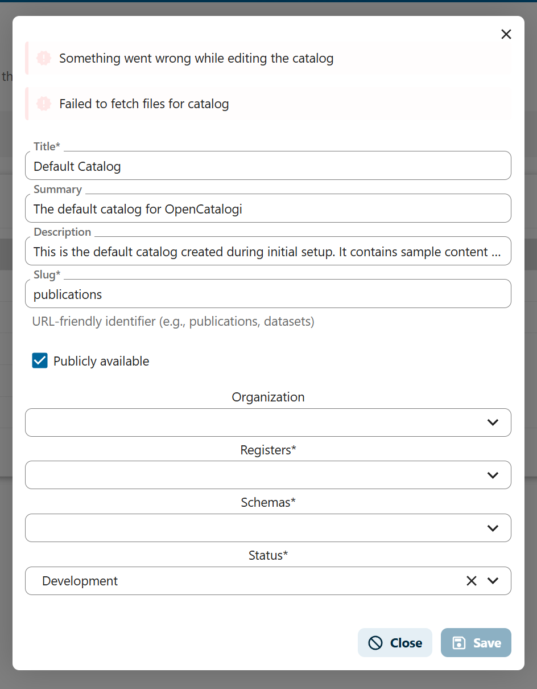

# Robots.txt and sitemap.xml

- https://sitemaps.org/protocol.html

Robots.txt is a textfile of public endpoints that can be crawled through by crawler bots. Its purpose is to let these bots know what pages should be indexed/crawled through and which not, so pages that should not be crawled through are also noted.

The robots.txt response looks like:

```
User-agent: *
Disallow:

Sitemap: https://cloud.example.com/index.php/apps/opencatalogi/{catalogiSlug}/sitemap.xml
Sitemap: https://cloud.example.com/index.php/apps/opencatalogi/{catalogiSlug}/sitemap.xml
```

This endpoint can be found `/apps/opencatalogi/robots.txt` and shows other sitemap.xml endpoints.

The robots.txt and sitemap.xml endpoints are not accessable from the root of the domain due to app structure in Nextcloud.
If these endpoints need to be accessed from the root of the domain a proxy should be configured from another domain which can be a frontend or any other service. 
 
## General sitemap.xml

Each catalog on OpenCatalogi has its own generic sitemap.xml on `/apps/opencatalogi/{catalogSlug}/sitemap.xml`

The sitemap returns a response like:

```
<?xml version="1.0" encoding="UTF-8"?>
<urlset xmlns="http://www.sitemaps.org/schemas/sitemap/0.9 ">
  <url>
    <loc><https://cloud.example.com/index.php/apps/opencatalogi/{catalogiSlug}/publications</loc>>
    <lastmod>2025-10-29</lastmod>
    <changefreq>weekly</changefreq>
    <priority>1.0</priority>
  </url>
</urlset>
```

The catalog currently only shows its publication endpoint if its set public. `/apps/opencatalogi/{catalogSlug}/pubications`
Other public endpoints and pages about the catalog should also be noted in this sitemap.xml.

## Woo sitemap.xml

There is also a sitemap specifically for Woo catalogs. It follows the open overheid standaard https://standaarden.overheid.nl/diwoo/metadata/doc/0.9.8/handleiding-sitemapindex-en-sitemaps.html

This can be toggled on or off on the create catalog modal and is turned off by default.



The endpoint is `/apps/opencatalogi/{catalogSlug}/woo-sitemap.xml`
It shows a xml response of all Woo categories and their publication sitemap.xml endpoints.
 
```
Show woo categorien index sitemap.xml
{
    "sitemapindex-diwoo-infocat001.xml": "Wetten en algemeen verbindende voorschriften",
    "sitemapindex-diwoo-infocat002.xml": "Overige besluiten van algemene strekking",
    "sitemapindex-diwoo-infocat003.xml": "Ontwerpen van wet- en regelgeving met adviesaanvraag",
    "sitemapindex-diwoo-infocat004.xml": "Organisatie en werkwijze",
    "sitemapindex-diwoo-infocat005.xml": "Bereikbaarheidsgegevens",
    "sitemapindex-diwoo-infocat006.xml": "Bij vertegenwoordigende organen ingekomen stukken",
    "sitemapindex-diwoo-infocat007.xml": "Vergaderstukken Staten-Generaal",
    "sitemapindex-diwoo-infocat008.xml": "Vergaderstukken decentrale overheden",
    "sitemapindex-diwoo-infocat009.xml": "Agenda's en besluitenlijsten bestuurscolleges",
    "sitemapindex-diwoo-infocat010.xml": "Adviezen",
    "sitemapindex-diwoo-infocat011.xml": "Convenanten",
    "sitemapindex-diwoo-infocat012.xml": "Jaarplannen en jaarverslagen",
    "sitemapindex-diwoo-infocat013.xml": "Subsidieverplichtingen anders dan met beschikking",
    "sitemapindex-diwoo-infocat014.xml": "Woo-verzoeken en -besluiten",
    "sitemapindex-diwoo-infocat015.xml": "Onderzoeksrapporten",
    "sitemapindex-diwoo-infocat016.xml": "Beschikkingen",
    "sitemapindex-diwoo-infocat017.xml": "Klachtoordelen"
  }
```

Then for each categorie a sitemap.xml exists like `/apps/opencatalogi/{catalogSlug}/sitemapindex-diwoo-infocat-?([0-9]{3})?.xml`

```
Show woo categorie specific sitemap.xml

```

This shows an index of endpoints where each endpoint leads to a publication its document in .xml format. 
A response of such publication in xml looks like:

```
Show woo document specific sitemap.xml
{
    "loc": "document.url",
    "lastmod": "{{ document._self.dateModified|date(\"Y-m-d H:i:s\") }}",
    "diwoo:Document.diwoo:DiWoo.diwoo:creatiedatum": "{{ document._self.dateCreated|date('Y-m-d') }}",
    "diwoo:Document.diwoo:DiWoo.diwoo:publisher.@resource": "publisher.resource",
    "diwoo:Document.diwoo:DiWoo.diwoo:publisher.#": "publisher.name",
    "diwoo:Document.diwoo:DiWoo.diwoo:format.@resource": "http://publications.europa.eu/resource/authority/file-type/{{ document.extension|upper }}",
    "diwoo:Document.diwoo:DiWoo.diwoo:format.#": "{{ document.extension|lower }}",
    "diwoo:Document.diwoo:DiWoo.diwoo:classificatiecollectie.diwoo:informatiecategorieen.diwoo:informatiecategorie.#": "object.categorie",
    "diwoo:Document.diwoo:DiWoo.diwoo:classificatiecollectie.diwoo:informatiecategorieen.diwoo:informatiecategorie.@resource": "https:\/\/identifier.overheid.nl\/tooi\/def\/thes\/kern\/{{ object.categorie|trans({'Wetten en algemeen verbindende voorschriften': 'c_139c6280', 'Overige besluiten van algemene strekking': 'c_aab6bfc7', 'Ontwerpen van wet- en regelgeving met adviesaanvraag': 'c_759721e2', 'Organisatie en werkwijze': 'c_40a05794', 'Bereikbaarheidsgegevens': 'c_89ee6784', 'Bij vertegenwoordigende organen ingekomen stukken': 'c_8c840238', 'Vergaderstukken Staten-Generaal': 'c_c76862ab', 'Vergaderstukken decentrale overheden': 'c_db4862c3', 'Agenda\\'s en besluitenlijsten bestuurscolleges': 'c_3a248e3a', 'Adviezen': 'c_99a836c7', 'Convenanten': 'c_8fc2335c', 'Jaarplannen en jaarverslagen': 'c_c6cd1213', 'Subsidieverplichtingen anders dan met beschikking': 'c_cf268088', 'Woo-verzoeken en -besluiten': 'c_3baef532', 'Onderzoeksrapporten': 'c_fdaee95e', 'Beschikkingen': 'c_46a81018', 'Klachtoordelen': 'c_a870c43d'}, '', 'en') }}",
    "diwoo:Document.diwoo:DiWoo.diwoo:documenthandelingen.diwoo:documenthandeling.diwoo:soortHandeling.#": "ontvangst",
    "diwoo:Document.diwoo:DiWoo.diwoo:documenthandelingen.diwoo:documenthandeling.diwoo:soortHandeling.@resource": "https://identifier.overheid.nl/tooi/def/thes/kern/c_dfcee535",
    "diwoo:Document.diwoo:DiWoo.diwoo:documenthandelingen.diwoo:documenthandeling.diwoo:atTime": "{{ object.publicatiedatum }}"
  }
```

```mermaid
graph TD
    A[Woo Sitemap Root apps/opencatalogi/catalogSlug/woo-sitemap.xml] --> B1[sitemapindex-diwoo-infocat001.xml\nWetten en algemeen verbindende voorschriften]
    A --> B2[sitemapindex-diwoo-infocat002.xml\nOverige besluiten van algemene strekking]
    %% Example structure for a category
    B1 --> C1[Woo Category Sitemap\n/apps/opencatalogi/catalogSlug/sitemapindex-diwoo-infocat001.xml]
    C1 --> D1[Document 1\nXML: diwoo:Document metadata]
    C1 --> D2[Document 2\nXML: diwoo:Document metadata]
    C1 --> D3[Document n\nXML: diwoo:Document metadata]

    %% Additional context
    subgraph Note[ ]
      N1[Each category sitemap lists publications xml\nEach publication XML includes diwoo:Document metadata such as:\n• loc document URL\n• lastmod ast modified\n• creatiedatum\n• publisher\n• format\n• categorie informatiecategorie\n• publicatiedatum]
    end
