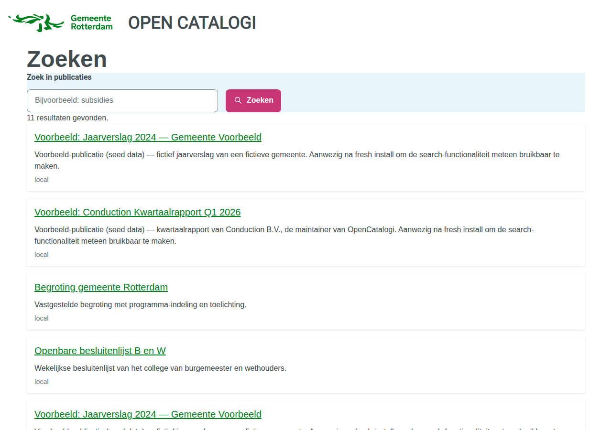
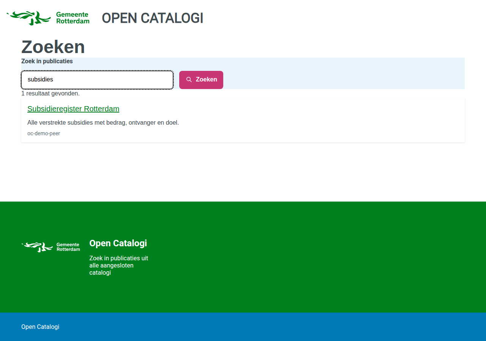

# A federated search portal, from nothing

At the end of this tutorial an anonymous visitor opens a public portal, types a
word, and gets publications back from **more than one catalogue** — each result
naming the catalogue it came from.



There are two roads to it, and they are not equivalent:

| | Road 1 — Docker Compose | Road 2 — App Store |
| --- | --- | --- |
| Time | one command, ~6 minutes | ~20 minutes |
| Federates with | a second local catalogue | `directory.opencatalogi.nl` |
| Needs the internet | no | yes |
| Shows federated results | **yes** | **no — see below** |
| Good for | seeing it work, demos, development | installing on your own instance |

Take Road 1 first even if Road 2 is your goal. It is the only one that shows
you what a working federation looks like, which is what you need in order to
recognise a broken one.

## Before you start: the national directory is empty

`directory.opencatalogi.nl` is the directory a fresh OpenCatalogi points at by
default. Asked for its listings on 2026-08-20 it answered:

```console
$ curl https://directory.opencatalogi.nl/apps/opencatalogi/api/directory
{"results":[],"total":0}
```

That is an HTTP 200. Nothing is broken and nothing is misconfigured — there is
simply nothing listed there yet. **An instance that federates with it will sync
successfully and receive zero catalogues**, and a portal reading the result
shows an empty list.

This matters because an empty portal looks exactly like a broken install. If
you follow Road 2 and see no federated results, that is expected, and this is
why.

Road 1 exists so you can see the mechanism actually work.

## Road 1 — the prefab rig

### What it starts

Two independent Nextcloud instances plus a database:

- **`oc-demo-main`** on <http://localhost:8580> — OpenRegister, OpenCatalogi,
  Portaliq and NLDesign. This one serves the portal.
- **`oc-demo-peer`** on <http://localhost:8581> — OpenRegister and OpenCatalogi
  only. A second catalogue with its own publications.

The peer deliberately does **not** run Portaliq. A publication from the peer
appearing on the main portal therefore cannot have got there any way except
federation.

### Run it

```bash
git clone https://github.com/ConductionNL/opencatalogi
cd opencatalogi

# Sibling checkouts of the other three apps, or set the *_PATH variables.
docker compose -f docker-compose.demo.yml up -d
bash docker/demo/provision.sh
```

`provision.sh` enables the apps in dependency order, seeds the peer, federates
the two instances, and then **verifies the result** rather than announcing it:

```
==> Verifying
  ok   the portal resolves and has a title (Open Catalogi)
  ok   the page at / renders and carries the search widget (federatedSearch)
  ok   the federated search endpoint returns publications (11)
  ok   the theme facet returns buckets on the local path (3)
  KNOWN  facets are dropped when results are federated — 0 buckets over 11 results.
  ok   a publication that exists ONLY on the peer is searchable, and names its source (oc-demo-peer)

Demo rig ready.
```

Then open <http://localhost:8580/index.php/apps/portaliq/site>.

### Prove it is really federated

Search for `subsidies`. One result comes back, and it is sourced from
`oc-demo-peer`:



`Subsidieregister Rotterdam` exists only on the peer. There is no copy of it on
the instance serving the portal — you can confirm that from the other side:

```bash
# On the portal instance's own catalogue: not there.
curl -s "http://localhost:8580/index.php/apps/opencatalogi/api/federation/publications?_aggregate=false&_search=Subsidieregister" \
  | python3 -c 'import sys,json; print(json.load(sys.stdin)["total"])'
# 0

# Across the federation: there.
curl -s "http://localhost:8580/index.php/apps/opencatalogi/api/federation/publications?_search=Subsidieregister" \
  | python3 -c 'import sys,json; print(json.load(sys.stdin)["total"])'
# 1
```

That difference — `_aggregate=false` returning 0 and the default returning 1 —
is federation, measured rather than asserted.

### Tear it down

```bash
docker compose -f docker-compose.demo.yml down -v
```

`-v` removes the seeded data too.

## Road 2 — installing by hand

### Install order is not a preference

```
OpenRegister  →  NLDesign  →  OpenCatalogi  →  Portaliq
```

OpenRegister owns the register and schema machinery every other app's install
hook writes into. Install OpenCatalogi or Portaliq first and their setup steps
find no OpenRegister, warn, and provision **nothing** — an install that reports
success and leaves you with an empty instance.

Portaliq goes last because the portal it seeds carries a search page pointed at
OpenCatalogi.

### Getting beta versions

The federated search block ships in Portaliq 0.1.9+ and OpenCatalogi 1.0.9+. At
the time of writing those are pre-release, so the App Store will not offer them
until your instance is on the beta channel:

1. **Settings → Administration → Apps**
2. Set the update channel to **beta**
3. Install in the order above

To test locally without waiting for a release, the `app_versions` app installs a
specific version from a local build.

### Bind a hostname before the portal will serve

Portaliq's install hook seeds a portal — but with **no domains**, so it does not
answer on any hostname yet. That is deliberate, and it is the one step you have
to do yourself.

A portal serves a hostname only when that domain is marked `verified`, and there
is no "default portal" fallback. Without that rule, pointing DNS at a
multi-tenant Portaliq would be enough to serve one tenant's content under
another tenant's domain. An install hook that marked a domain verified would be
asserting control of a hostname on your behalf, which is exactly what the flag
exists to prevent.

So: open the portal in Portaliq's admin, add your hostname, and verify it.

Until then the portal is reachable by slug at `/site?portal=demo`.

### What you will and will not see

You will get a themed, working portal that searches **your own** publications.

You will **not** see federated results, because the national directory is empty
(see the top of this page). Nothing is wrong with your install.

## Theming

The portal in the screenshots uses the `rotterdam` token set from the NLDesign
app: RODS colours, RODS typography, and Rotterdam's own mapping onto NL Design
System components — which is why the primary action button is magenta rather
than green, and why links are black until you hover them. Those are Rotterdam's
decisions, taken verbatim from `@gemeente-rotterdam/design-tokens`.

Change one field on the portal object to re-theme it:

```bash
# Any set listed in nldesign's token-sets.json
theme: "denhaag"
```

A theme that does not resolve renders the portal **unstyled** rather than
falling back to another municipality's brand. An unstyled page is visibly broken
and gets reported; a Venray portal wearing Tilburg's colours looks completely
fine and is wrong in the one way nobody screenshots.

:::note Rotterdam is shipped as an example theme
The set is included so the demo has a real municipal design to wear. It is not
an endorsement by, or an affiliation with, the Gemeente Rotterdam.
:::

## Known limitations

These are measured on the rig above, not theoretical. Each one is a thing you
will notice and should not spend time debugging.

### Facet buckets cover local publications only

The federated request *does* return facets. They are the **local** facets:

| Request | Results | Buckets |
| --- | ---: | --- |
| `?_facets[themes][type]=terms&_aggregate=false` | 4 | `bestuur=2, openbaarheid=1, financien=1` |
| `?_facets[themes][type]=terms` | 11 | `bestuur=2, openbaarheid=1, financien=1` |

Identical buckets, different totals. The seven federated publications carry
themes of their own — `vergunningen`, `ruimte`, `verkeer` — and appear in no
bucket at all.

So a visitor filtering by theme is filtering a corpus that is not the one they
are searching. Counting buckets hides this completely: three buckets come back
either way, and the feature looks like it works. `provision.sh` compares the two
bucket *sets* and prints the finding on every run.

If your instance has no local publications carrying themes, you will see no
facet column at all — same cause, different symptom.

### There is no filter on the source catalogue

Every result carries `@self.directory`, and the API accepts
`@self[directory]=<peer>` — and answers `total: 0`, on a corpus where every row
has that field populated. `_directory=<peer>` is accepted and ignored.

So the source is **shown** on each result and cannot be **filtered** on. A
control that silently empties the page is worse than an absent one: the visitor
concludes the catalogue is empty and nothing contradicts them.

### Results link to the raw record

A result links to its object in the OpenRegister API, which is JSON. It
resolves, and it is not a page for a citizen. A publication detail page is a
missing feature, not a broken link.

### Directory sync must be authenticated

`POST /api/directory` is a public endpoint, so an anonymous call is accepted —
and then fails to write anything, because creating a Listing is a write that
OpenRegister refuses to `Anonymous`:

```
User 'Anonymous' does not have permission to 'create' objects in schema 'Listing'
```

The endpoint still answers `{"message": "Directory synchronized successfully"}`.
**The failure appears only in the counts**, so read `listings_created` /
`listings_failed`, never the message.

### Federating with a peer on a private network needs an opt-in

OpenCatalogi refuses directory URLs that resolve to private or loopback
addresses — an SSRF guard, and on an internet-facing instance it is doing
exactly its job. Two containers on a Docker network are all private addresses,
so the rig turns the guard off for private ranges only:

```bash
occ config:app:set opencatalogi allow_internal_directories --value yes
```

It defaults to `no`. The cloud-metadata endpoint (`169.254.169.254`) and the
unspecified addresses stay blocked whatever this is set to, and every address it
lets through is logged at WARNING.

**Never set this on an internet-facing instance.**

## Troubleshooting

**The portal shows "Pagina niet gevonden".**
The portal resolved but has no page at that route. Content is scoped by portal
**slug**, not by id — a page whose `portal` field holds the portal's UUID
matches nothing, and the portal renders its own header and footer around a 404.

**The portal shows nothing at all / every request 404s.**
No verified domain is bound. See *Bind a hostname* above.

**Search returns 0 results, but the objects exist.**
Publications are readable anonymously only through a conditional rule:

```json
"read": [{"group": "public", "match": {"publicationDate": {"$lte": "$now"}}}, "authenticated"]
```

A publication with no `publicationDate` — or one dated in the future — matches
no public rule. It stays perfectly visible to you as admin, which is what makes
this one hard to spot: the object is there, the count is right, and the portal
is empty.

**A field is stored but cannot be searched or faceted.**
It is probably not declared on the schema. An undeclared field is stored,
returned on the object, and invisible to search. `themes` is declared on
`publication`; `categories` is not — it belongs to the software/publiccode
schema.
