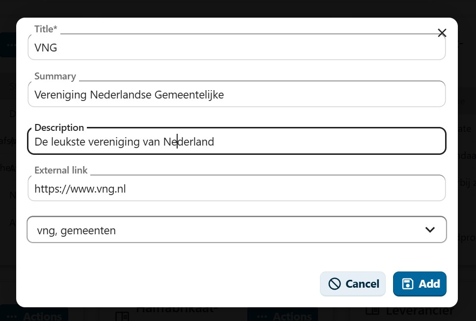

# Glossary Management

## Overview

The glossary management system allows administrators to create and maintain a glossary of terms for the OpenCatalogi application. Glossary terms help users understand domain-specific terminology by providing definitions, descriptions, and links to external resources. The glossary is accessible on the public-facing website and can be used to standardize language across the platform.

## Term Properties

### Title
- **Type**: String
- **Description**: The term being defined
- **Required**: Yes
- **Max Length**: 255 characters

### Summary
- **Type**: String
- **Description**: A short, concise explanation of the term
- **Required**: No
- **Max Length**: 255 characters

### Description
- **Type**: String
- **Description**: A detailed explanation or definition of the term
- **Required**: No
- **Max Length**: 2555 characters

### External Link
- **Type**: URL
- **Description**: A link to an external resource with more information about the term
- **Required**: No
- **Validation**: Must be a valid URL

### Keywords
- **Type**: Array of strings
- **Description**: Tags or keywords associated with the term for searchability and categorization
- **Required**: No

## Creating a Glossary Term

1. Navigate to the **Glossary** section in the admin interface
2. Click the **Add Glossary** button
3. Fill in the term details:
   - **Title**: Enter the term to be defined (required)
   - **Summary**: Enter a short explanation
   - **Description**: Enter a detailed definition
   - **External Link**: Add a URL to an external resource
   - **Keywords**: Select or add tags for categorization
4. Click **Add** to save the glossary term

<figure><figcaption>
The Add Glossary Term modal
</figcaption></figure>

> **Note**: Only the Title field is required. All other fields are optional but recommended for completeness.

## Managing Glossary Terms

### Viewing Terms

1. Click on a glossary term in the list to open the detail view
2. The detail view shows:
   - **Basic Information**: Title, status (Published/Draft), summary, and description
   - **External Link**: Clickable link to the external resource
   - **Keywords**: Displayed as tags
   - **Related Terms**: Other glossary terms that are related
   - **Metadata**: Technical details in JSON format
3. Click **Close** to return to the list

### Editing Terms

1. Click on a glossary term in the list
2. Click **Edit** to open the edit modal
3. Modify the fields as needed
4. Click **Save** to apply changes

### Copying Terms

- Use the **Copy** action from the term's action menu to duplicate an existing term
- This creates a new glossary term with the same content
- Modify the copy as needed

### Deleting Terms

- Use the **Delete** action to remove a glossary term
- This action cannot be undone

## View Modes

The glossary management interface supports two view modes:

### Cards View
- Displays glossary terms as individual cards
- Shows the title, summary, status, description, related terms count, and keywords
- Provides quick access to common actions

### Table View
- Displays glossary terms in a tabular format
- Shows title, status (Published/Draft), related terms count, and keywords in columns
- Supports bulk selection and operations

## Best Practices

1. **Consistent Definitions**: Write definitions that are clear, concise, and consistent in tone
2. **Use Summaries**: Always include a summary for quick reference, keeping it under one sentence
3. **External References**: Link to authoritative external sources when available
4. **Keywords**: Add relevant keywords to improve searchability and group related terms
5. **Regular Review**: Periodically review glossary terms to ensure definitions remain accurate and current
6. **Avoid Jargon in Definitions**: Define terms using plain language to make the glossary accessible to all users
