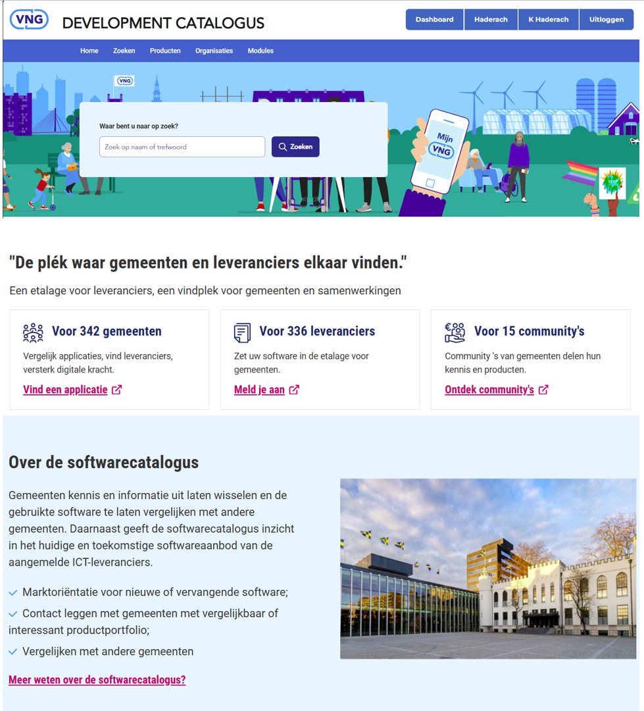
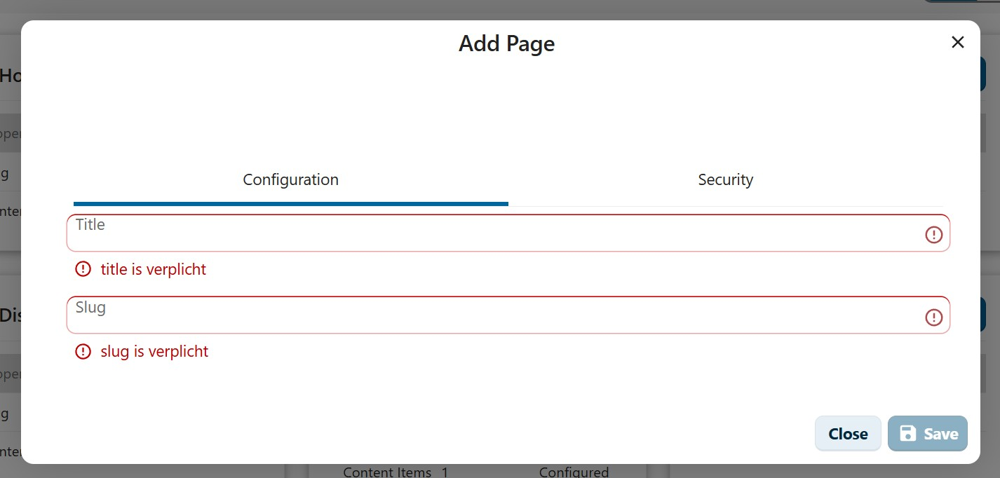
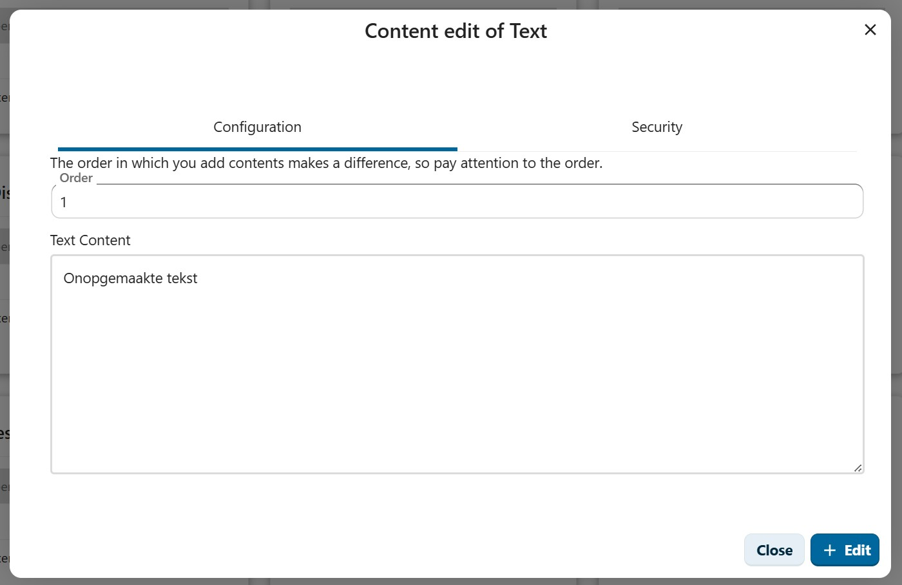
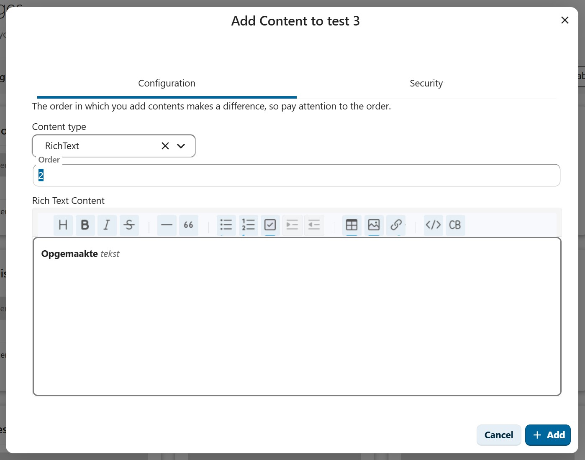
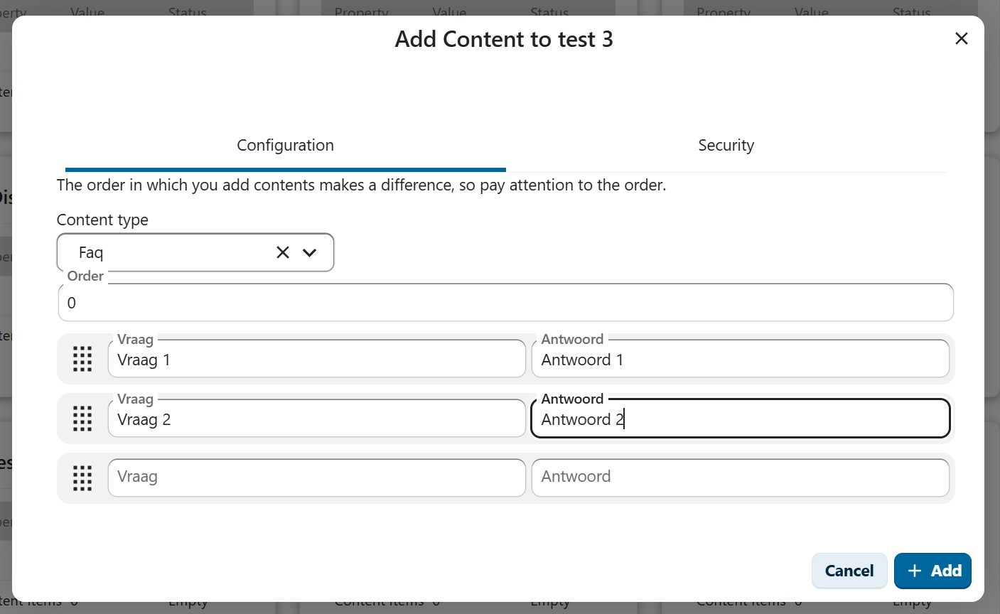
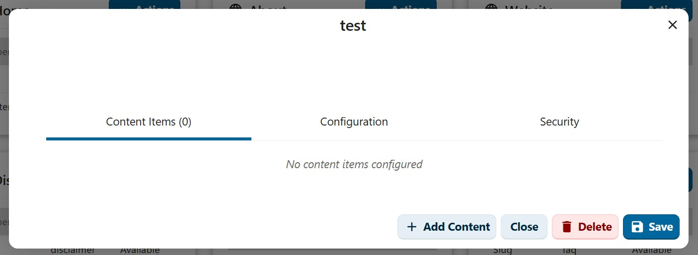

# Page Management

## Overview

The page management system allows administrators to create and manage content pages for the OpenCatalogi website. Pages appear on the public-facing website and can contain multiple content blocks of different types, such as plain text, rich text, and FAQ sections. This makes it possible to build informational pages like "About", "Disclaimer", or "Help" directly from the admin interface.

<figure><figcaption>
Example of the OpenCatalogi website with pages
</figcaption></figure>

## Page Properties

### Title
- **Type**: String
- **Description**: The display name of the page, shown in navigation and as the page heading
- **Required**: Yes

### Slug
- **Type**: String
- **Description**: URL-friendly identifier for the page (lowercase letters, numbers, and hyphens only)
- **Required**: Yes
- **Example**: `about-us`, `disclaimer`, `help`

### Content Items
- **Type**: Array of content blocks
- **Description**: The individual content sections that make up the page body
- **Required**: No (page can be empty)
- **Note**: The order in which content items are added determines their display order on the page

### Security Settings
- **Groups**: Restrict page visibility to specific Nextcloud groups
- **Hide After Login**: Hide the page from authenticated users
- **Hide Before Login**: Hide the page from unauthenticated visitors

## Creating a Page

1. Navigate to the **Pages** section in the admin interface
2. Click the **Add Page** button
3. Fill in the required fields on the **Configuration** tab:
   - **Title**: Enter a descriptive name for the page
   - **Slug**: Enter a URL-friendly identifier (e.g., `about-us`)
4. Optionally, switch to the **Security** tab to configure access control
5. Click **Save** to create the page

<figure><figcaption>
The Add Page modal with Configuration and Security tabs
</figcaption></figure>

> **Note**: Both the title and slug are required fields. The slug must be unique across all pages and may only contain lowercase letters, numbers, and hyphens.

## Managing Content Items

After creating a page, you can add content blocks to build the page body. Each content item has a type, an order number, and type-specific content.

### Adding Content

1. Click on a page in the list to open the edit modal
2. On the **Content Items** tab, click **+ Add Content**
3. Select a **Content type** from the dropdown
4. Set the **Order** number (determines position on the page)
5. Fill in the type-specific content (see content types below)
6. Click **+ Add** to save the content item

### Content Types

#### Text

Plain text content without formatting. Suitable for simple paragraphs or notices.

<figure><figcaption>
The Text content type with a plain text area
</figcaption></figure>

- **Text Content**: A plain text area for unformatted content
- The text is rendered as-is on the page

#### Rich Text

Formatted content with a WYSIWYG (What You See Is What You Get) editor. Supports headings, bold, italic, strikethrough, lists, checkboxes, tables, images, links, and code blocks.

<figure><figcaption>
The Rich Text content type with a full formatting toolbar
</figcaption></figure>

- **Rich Text Content**: A WYSIWYG editor with a formatting toolbar
- Supports: Headings, **Bold**, *Italic*, ~~Strikethrough~~, horizontal rules, block quotes, bullet lists, numbered lists, checkboxes, text alignment, tables, images, links, code, and code blocks

#### FAQ

A structured question-and-answer section. Ideal for frequently asked questions pages.

<figure><figcaption>
The FAQ content type with question and answer pairs
</figcaption></figure>

- Each FAQ item consists of a **Vraag** (Question) and **Antwoord** (Answer) field
- You can add multiple FAQ pairs
- Use the drag handle on the left to reorder items
- New empty rows are added automatically

### Editing Content

1. Click on a page to open the edit modal
2. On the **Content Items** tab, click **Edit** next to the content item you want to modify
3. Make your changes
4. Click **+ Edit** to save

<figure><figcaption>
The page edit modal with Content Items, Add Content, Close, Delete, and Save buttons
</figcaption></figure>

### Deleting Content

1. Click on a page to open the edit modal
2. On the **Content Items** tab, click **Delete** next to the content item you want to remove
3. The content item is removed immediately

> **Important**: The order of content items matters. Items are displayed on the page in the order specified by their Order number. Plan your content structure accordingly.

## Page Operations

### Editing Pages

1. Click on a page in the list
2. Modify the title, slug, content items, or security settings
3. Click **Save** to apply changes

### Copying Pages

- Use the **Copy** action from the page's action menu to duplicate an existing page
- This creates a new page with the same configuration and content
- Modify the copy as needed (remember to change the slug)

### Deleting Pages

- Use the **Delete** action to remove a page and all its content items
- This action cannot be undone

## View Modes

The page management interface supports two view modes:

### Cards View
- Displays pages as individual cards
- Shows the page title, slug, content item count, and last updated date
- Provides quick access to common actions

### Table View
- Displays pages in a tabular format
- Shows key information in columns
- Supports bulk selection and operations

## Best Practices

1. **Descriptive Slugs**: Use clear, descriptive slugs that reflect the page content (e.g., `about-us` instead of `page-1`)
2. **Content Order**: Plan the order of content items before adding them, as the order determines the page layout
3. **Content Types**: Use Rich Text for most content, plain Text for simple blocks, and FAQ for question-and-answer sections
4. **Access Control**: Use the Security tab to control page visibility based on user groups or authentication status
5. **Regular Review**: Periodically review page content to ensure it remains accurate and up to date
