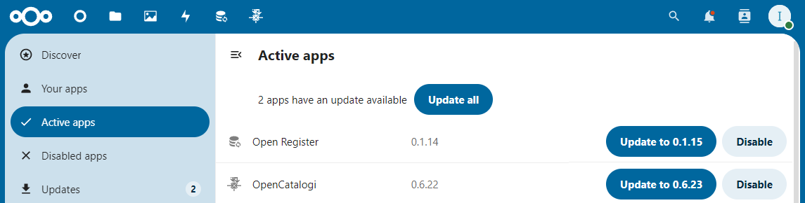

# Installation Instructions 
An installation of Open Catalogi always consists of two parts

1. Setting up a Nextcloud instance
2. Setting up a frontend

## Nextcloud

### Installation Instructions for Nextcloud

Follow these steps to easily install and use Nextcloud:

1. **Download and create an account with a Nextcloud provider**:
   * Go to the [Nextcloud website](https://nextcloud.com/signup/), download the app for your operating system
   * When starting the app, you can choose between a server and creating an account. Create an account if you don't have one yet.
   * We chose TheGoodCloud, without any particular preference.
   * You will receive an activation email, this can take up to 6 hours. As always, also check your spam folder.
   *   Once logged in, the screen looks like this:\
       \

       
       <figcaption>the good cloud welcome</figcaption>
2. **Install Nextcloud app via the app store**:

Note! You need an admin account for this. This may not work with trial versions.

* Navigate to your profile icon, on the right in the Nextcloud app. Click on it and choose "Apps".

\

<figure><figcaption>
App menu
</figcaption></figure>

3. **Install OpenCatalogi**:

* After you are logged in to the Nextcloud app, go to the app store within the Nextcloud environment.
* Search for "OpenCatalogi" within the "Integration" category and install the app.

<figure><figcaption></figcaption></figure>

With these steps you are ready to use Nextcloud and OpenCatalogi without having to set up your own server. If you have any questions or need help, consult the [official Nextcloud documentation](https://docs.nextcloud.com/) or send an email to support@conduction.nl.

** Update OpenCatalogi**

### Installation Instructions for Frontend

There are several installation options, we recommend using the publication platform developed by [Acato](acato.nl) in collaboration with [Tilburg](tilburg.nl). This is available as a Docker container via the [Conduction Github](https://github.com/orgs/ConductionNL/packages?repo_name=tilburg-woo-ui). In the repository itself you will find besides a [docker-compose](https://github.com/ConductionNL/tilburg-woo-ui/blob/softwarecatalogus/docker-compose.yml) also further [installation instructions](https://github.com/ConductionNL/tilburg-woo-ui/tree/softwarecatalogus). 