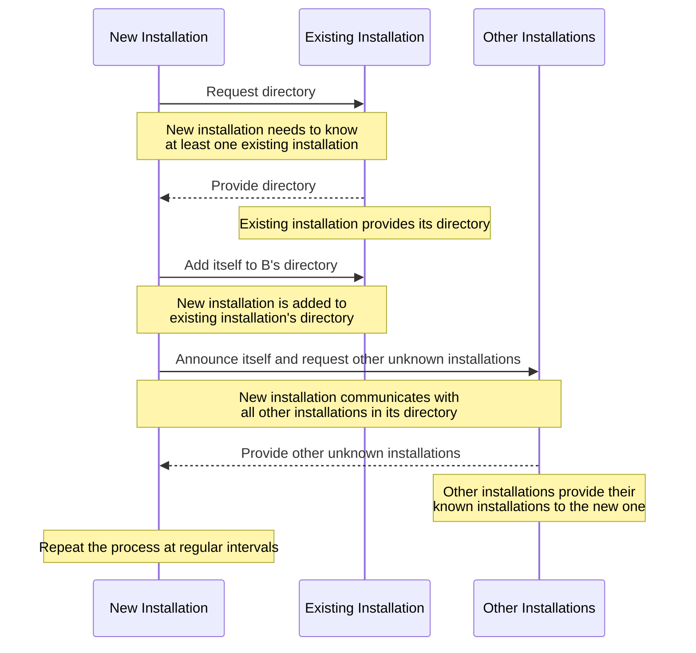

# Architectuur

## Bodyless

In de meest simpele opzet is een OpenCatalogi-installatie een stateless/platte React frontend die gegevens weergeeft uit het OpenCatalogi federatieve netwerk.

Als er geen aanvullende business logica van toepassing is (zoals rollen en rechten) en de data uit het federatieve netwerk direct wordt weergegeven is er geen noodzaak voor een backend.

## Federatieve netwerk

## Datamodel

Het datamodel van OpenCatalogi is gebaseerd op Public Code, een Europese standaard voor het beschrijven van opensource-projecten. Dit model vertaald naar een OpenAPI-beschrijving in lijn met de NL API-strategie. Deze is standaard is tevens aangevuld met elementen uit de huidige Common Ground catalogus en developer.overheid om te komen tot een overkoepeld datamodel voor opensource in Nederland.

Lees meer:

- [Het volledige datamodel](https://conduction.stoplight.io/docs/publiccode)
- [Afwijkingen ten opzichte van publiccode](https://github.com/OpenCatalogi/.github/discussions/10)

Het systeem is verdeeld in verschillende lagen. Laag 5 is de interactielaag, Laag 4 is de logische laag en Laag 1 is de datalaag.

Laag 5 (Interactie) bevat de gebruikersinterface en de beheerdersinterface. Deze interfaces zijn respectievelijk ondergebracht in React Container 1 en React Container 2. De gebruiker en beheerder communiceren met deze interfaces via webbrowsers. De interactie van de gebruiker via de browser is anoniem, terwijl de interactie van de beheerder JWT-claims bevat.

Laag 4 (Logica) is de kern van het systeem en bestaat uit meerdere componenten. De NGINX-container bevat de Nginx-grens die de Web Gateway uitvoert, die is ondergebracht in de Gateway Container. De Gateway Container bevat ook de OpenCatalogi-plugin en de ORM (Object-Relationele Mapping). De Gateway implementeert deze plug-ins en communiceert met het identiteitscomponent in de Azure-cloud. De Gateway maakt ook indexen naar MongoDB, caches naar Redis en slaat gegevens op in de ORM.

De Redis Container bevat het Redis-component en de MongoDB Container bevat de MongoDB-database. De Gateway logt naar Loki en rapporteert aan Prometheus. De OpenCatalogi-plugin wisselt informatie uit met de externe catalogus op basis van PKI (Public Key Infrastructure).

Laag 1 (Data) bevat een Database Service die verschillende databasesystemen bevat zoals PostgreSQL, MsSQL, MySQL en Oracle. De ORM slaat gegevens op in deze databases.

Het systeem is ondergebracht in een Kubernetes-cluster. Het ingress-component maakt de gebruikersinterface, de beheerdersinterface en het Nginx-component beschikbaar. Het ingress-component communiceert met F5 extern alleen voor openbare eindpunten en objecten, en met F5 intern voor alle eindpunten. Het communiceert ook met het Hipp-component voor catalogusuitwisseling.

De externe catalogus communiceert met het Hipp-component met behulp van PKIO. Het Hipp-component valt buiten de scope van het systeem.

De Azure-cloud bevat het ADFS-component dat fungeert als een identiteitsprovider.

Ten slotte omvat het systeem een externe catalogusacteur die communiceert met het Hipp-component, en een beheerdersacteur die communiceert met het F5 intern-component via een browser met JWT-claims. Er is ook een gebruikersacteur die communiceert met het F5 extern-component via een anonieme browser.

**User perspectief:**

```mermaid
graph TD
    user["👤 User"] <-.->|Browser ANONIEM| f5extern["F5 extern (port 443)"]
    subgraph azure["Azure"]
        identity["ADFS"]
    end
    subgraph internet["Internet"]
        externalCatalog["External Catalog"]
    end
    f5extern <-.->|"/api/search/* en andere"| ingress
    subgraph kubernetes["Kubernetes"]
        ingress["ingress"]
        loki[("loki")]
        prometheus[("prometheus")]
        subgraph layer5u["Layer 5 (interaction)"]
            ui["User Interface"]
        end
        subgraph layer4u["Layer 4 (Logic)"]
            NginxU["Nginx"]
            GatewayU["Web Gateway"]
            PluginsU["Open Catalogi plugin"]
            ORMU["ORM"]
            RedisU["Redis"]
            MongoDBU[("MongoDB")]
        end
    end
    subgraph layer1u["Layer 1 (data)"]
        dbU[("PostgreSQL/MsSQL/MySQL/Oracle")]
    end
    ingress <-.-> ui
    ingress <-.-> NginxU
    NginxU <-.-> GatewayU
    GatewayU <-.-> PluginsU
    GatewayU <-.-> identity
    GatewayU -.-> loki
    GatewayU -.-> prometheus
    PluginsU <-.-> externalCatalog
    GatewayU -.-> MongoDBU
    GatewayU -.-> RedisU
    GatewayU -.-> ORMU
    ORMU -.-> dbU
```

**Admin perspectief:**

```mermaid
graph TD
    adminUser["👤 Admin"] <-.->|Browser MET JWT Claim| f5intern["F5 Extern (port 443)"]
    subgraph azure2["Azure"]
        identity2["ADFS"]
    end
    subgraph internet2["Internet"]
        externalCatalog2["External Catalog"]
    end
    f5intern <-.->|"/api/admin/*"| ingress2["ingress"]
    subgraph kubernetes2["Kubernetes"]
        ingress2
        loki2[("loki")]
        prometheus2[("prometheus")]
        subgraph layer5a["Layer 5 (interaction)"]
            admin2["Admin Interface"]
        end
        subgraph layer4a["Layer 4 (Logic)"]
            NginxA["Nginx"]
            GatewayA["Web Gateway"]
            PluginsA["Open Catalogi plugin"]
            ORMA["ORM"]
            RedisA["Redis"]
            MongoDBA[("MongoDB")]
        end
    end
    subgraph layer1a["Layer 1 (data)"]
        dbA[("PostgreSQL/MsSQL/MySQL/Oracle")]
    end
    ingress2 <-.-> admin2
    ingress2 <-.-> NginxA
    NginxA <-.-> GatewayA
    GatewayA <-.-> PluginsA
    GatewayA <-.-> identity2
    GatewayA -.-> loki2
    GatewayA -.-> prometheus2
    PluginsA <-.-> externalCatalog2
    GatewayA -.-> MongoDBA
    GatewayA -.-> RedisA
    GatewayA -.-> ORMA
    ORMA -.-> dbA
```

**Externe Catalogus perspectief:**

```mermaid
graph TD
    externalCatalouge["👤 Externe Catalogus"] <-.->|PKIo| hipp["Mtls (PKIo)"]
    hipp <-.->|"/api/catalogi/*"| ingress3["ingress"]
    subgraph kubernetes3["Kubernetes"]
        ingress3
        loki3[("loki")]
        prometheus3[("prometheus")]
        subgraph layer4e["Layer 4 (Logic)"]
            NginxE["Nginx"]
            GatewayE["Web Gateway"]
            PluginsE["Open Catalogi plugin"]
            ORME["ORM"]
            RedisE["Redis"]
            MongoDBE[("MongoDB")]
        end
    end
    subgraph layer1e["Layer 1 (data)"]
        dbE[("PostgreSQL/MsSQL/MySQL/Oracle")]
    end
    ingress3 <-.-> NginxE
    NginxE <-.-> GatewayE
    GatewayE <-.-> PluginsE
    GatewayE -.-> loki3
    GatewayE -.-> prometheus3
    GatewayE -.-> MongoDBE
    GatewayE -.-> RedisE
    GatewayE -.-> ORME
    ORME -.-> dbE
```

## Hoe vormt OpenCatalogi een gefedereerd netwerk?

Elke OpenCatalogi-installatie (aangeduid als een Catalogus) onderhoudt een directorylijst van andere bekende installaties (of catalogi). Wanneer een nieuwe installatie aan het netwerk wordt toegevoegd, moet deze op de hoogte zijn van, of ten minste één bestaande installatie vinden. Deze bestaande installatie verstrekt zijn directory aan de nieuwe installatie, waardoor deze op de hoogte wordt gebracht van alle andere bekende installaties. Tijdens dit proces wordt de nieuwe installatie ook toegevoegd aan de directory van de bestaande installatie, die als referentie wordt gebruikt.

Vervolgens communiceert de nieuwe installatie met alle andere installaties die vermeld staan in zijn directory. Het doel van deze communicatie is tweeledig: het aankondigen van zijn toevoeging aan het netwerk en informeren of ze op de hoogte zijn van andere installaties die nog niet zijn opgenomen in de directory van de nieuwe installatie.

Dit onderzoekproces wordt regelmatig herhaald. Omdat elke installatie zijn eigen directory bijhoudt, blijft het netwerk robuust en operationeel, zelfs als een individuele installatie niet beschikbaar is.

## Hoe maakt OpenCatalogi gebruik van een gefedereerd netwerk?

**Live gegevens**:
Telkens wanneer een query wordt uitgevoerd naar het `/search` eindpunt van een OpenCatalogi-installatie, zoekt het antwoorden in zijn eigen MongoDB-index op basis van bepaalde filters. Tegelijkertijd controleert het ook zijn directory van bekende catalogi om andere catalogi te vinden die mogelijk de gevraagde gegevens bevatten en waar de oorspronkelijke catalogus toegang toe heeft. De query wordt ook asynchroon naar deze catalogi verzonden, en de reacties worden gecombineerd, tenzij een vooraf gedefinieerde time-outdrempel wordt bereikt.

```mermaid
graph TD
    user["👤 User"] <-.->|Browser ANONIEM| f5extern["F5 extern (port 443)"]
    adminUser["👤 Admin"] <-.->|Browser MET JWT Claim| f5intern["F5 intern (port 443)"]
    externalCatalouge["👤 Externe Catalogus"] <-.->|PKIO| hipp["Hipp (out of scope)"]
    subgraph azure["Azure"]
        identity["ADFS"]
    end
    subgraph internet["Internet"]
        externalCatalog["External Catalog"]
    end
    subgraph kubernetes["Kubernetes"]
        ingress["ingress"]
        loki[("loki")]
        prometheus[("prometheus")]
        subgraph layer5["Layer 5 (interaction)"]
            uiL["User Interface"]
            adminL["Admin Interface"]
        end
        subgraph layer4["Layer 4 (Logic)"]
            NginxL["Nginx"]
            GatewayL["Web Gateway"]
            PluginsL["Open Catalogi plugin"]
            ORML["ORM"]
            RedisL["Redis"]
            MongoDBL[("MongoDB")]
        end
    end
    subgraph layer1["Layer 1 (data)"]
        dbL[("PostgreSQL/MsSQL/MySQL/Oracle")]
    end
    f5extern <-.->|Alleen openbare endpoints| ingress
    f5intern <-.->|Alle endpoints| ingress
    hipp <-.->|Catalogus uitwisselingen| ingress
    ingress <-.-> uiL
    ingress <-.-> adminL
    ingress <-.-> NginxL
    NginxL <-.-> GatewayL
    GatewayL <-.-> PluginsL
    GatewayL <-.-> identity
    GatewayL -.-> loki
    GatewayL -.-> prometheus
    PluginsL <-.-> externalCatalog
    GatewayL -.-> MongoDBL
    GatewayL -.-> RedisL
    GatewayL -.-> ORML
    ORML -.-> dbL
```

**Geïndexeerde gegevens**:
OpenCatalogi geeft de voorkeur aan het indexeren van gegevens wanneer de bron dit toestaat. Tijdens elke uitvoer van netwerksynchronisatie (zoals uitgelegd in 'Hoe vormt OpenCatalogi een gefedereerd netwerk?'), worden alle gegevens die kunnen worden geïndexeerd, geïndexeerd als de bron is ingesteld op indexering. Het is belangrijk op te merken dat wanneer een object wordt gedeeld vanuit een andere catalogus, er een cloudgebeurtenisabonnement wordt gemaakt. Dit betekent dat wanneer het object wordt bijgewerkt in die catalogus, de wijzigingen ook vrijwel direct worden bijgewerkt in de lokale installatie.

> :note:
>
> - Bronnen worden pas gebruikt door een catalogus als de beheerder hiervoor akkoord heeft gegeven
> - Bronnen kunnen zelf voorwaarden stellen aan het gebruikt (bijvoorbeeld alleen met PKI-certificaat, of aan de hand van API-sleutel)
